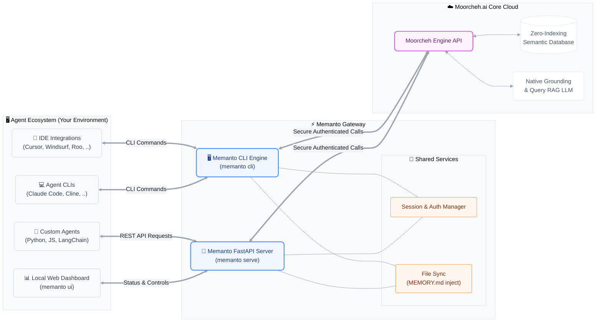

<p align="center">
    <a href="https://www.moorcheh.ai/">
    
    </a>
</p>

<div align="center">
  <h1>MemAnto - Universal Memory Layer for Agentic AI</h1>
</div>

<p align="center">
  <a href="https://moorcheh.ai/">Learn more</a>
  ·
  <a href="https://discord.gg/CyxRFQSQ3p">Join Discord</a>
</p>

<p align="center">
    <a href="https://discord.gg/CyxRFQSQ3p"></a>
    <a href="https://opensource.org/licenses/MIT"></a>
    <a href="https://pypi.org/project/memanto/"></a>
    <a href="https://x.com/moorcheh_ai" target="_blank"></a>
</p>

---

## What Is MEMANTO?

MEMANTO is a universal memory layer for agentic AI. While LLMs often forget context between sessions, MEMANTO gives your agents long-term memory so they can carry context forward and remember what matters across sessions.

## Why MEMANTO Performs

MEMANTO is built for teams that want high-quality agent memory without graph-heavy complexity. It combines immediate semantic availability, low-overhead serverless operation, and strong real-world memory accuracy so you can ship production workflows with a simpler architecture.

- **Zero-cost ingestion latency**: No indexing wait or token usage at ingestion, so memories are available for retrieval immediately.
- **Zero storage cost at idle**: Serverless architecture scales to zero when not in use.
- **State-of-the-art benchmark performance**: Final evaluation results reached **89.8% on LongMemEval** and **87.1% on LoCoMo**.

## 🏗️ Architecture


---

## 🚀 MEMANTO CLI

MEMANTO comes with a powerful, developer-friendly Command Line Interface. You can initialize your environment, start the server, and manage your agent's memories completely from your terminal!

You need a Moorcheh API key to use MEMANTO. Create one in the [Moorcheh Dashboard](https://console.moorcheh.ai/api-keys).

MEMANTO has native LLM access, so you don't need a separate external model API key for common memory workflows.

### 1. Install & Configure
```bash
pip install memanto

# Setup your environment (prompts for your Moorcheh API key)
memanto
```

### 2. Test Agent Memories
```bash
# Create and activate an agent session
memanto agent create customer-support
memanto agent activate customer-support

# Store memories with specific semantic types
memanto remember "The user prefers dark mode for the dashboard."
memanto remember "User's timezone is PST."

# Instantly recall relevant context
memanto recall "What mode does the user like?"

# Get grounded AI answers using built-in RAG
memanto answer "Based on the memory, what should the theme be set to?"
```

### Supported Memory Types

`instruction`, `fact`, `decision`, `goal`, `commitment`, `preference`, `relationship`, `context`, `event`, `learning`, `observation`, `artifact`, `error`

Use memory types to categorize what you store so retrieval is cleaner and more controllable:
- Save with a specific type: `memanto remember "User prefers concise answers" --type preference`
- Filter by type when searching: `memanto recall "user communication style" --type preference`

---

### Key Features
| Capability | Commands | What it does |
|---|---|---|
| System status dashboard | `memanto status` | View environment, configuration, server health, active session, and registered agents. |
| Local server + web dashboard | `memanto serve`, `memanto ui` | Run the MEMANTO API locally and open an interactive browser UI. |
| Agent lifecycle management | `memanto agent ...` | Create/list agents, activate/deactivate sessions, and run `agent bootstrap` for an intelligence snapshot. |
| Memory capture at scale | `memanto remember` | Store single memories with metadata or batch-ingest up to 100 records from JSON. |
| Advanced retrieval modes | `memanto recall` | Run standard search plus temporal queries (`--as-of`, `--changed-since`, `--current-only`) with filters. |
| Grounded QA over memory | `memanto answer` | Generate RAG answers using retrieved memory context. |
| Daily intelligence workflows | `memanto daily-summary`, `memanto conflicts` | Generate summaries, detect contradictions, and resolve conflicts interactively. |
| Session and automation controls | `memanto session ...`, `memanto schedule ...` | Inspect/extend sessions and enable scheduled daily summary runs. |
| Memory file pipelines | `memanto memory export`, `memanto memory sync` | Export structured memory markdown and sync `MEMORY.md` into projects. |
| Configuration inspection | `memanto config show` | Inspect API key status, active agent/session, server settings, and schedule time. |
| Multi-agent ecosystem integration | `memanto connect ...` | Connect/remove/list integrations for Claude Code, Codex, Cursor, Windsurf, Antigravity, Gemini CLI, Cline, Continue, OpenCode, Goose, Roo, GitHub Copilot, and Augment (local or global). |

Additional setup guides are available at the Moorcheh [YouTube channel](https://www.youtube.com/@moorchehai/videos).

---

## 🎯 REST API Endpoints

For programmatic access, MEMANTO exposes a clean, session-based REST API.

**Important:** MEMANTO does not have a hosted API server yet. To use these endpoints, run your own local server first:

```bash
cd memanto

# Start server
memanto serve
```

By default, call the endpoints on your local server (for example: `"http://127.0.0.1:8000"`).

### Agent Management
- `POST /api/v2/agents` - Create a new agent namespace
- `GET /api/v2/agents` - List all available agents
- `GET /api/v2/agents/{agent_id}` - Get metadata for a specific agent
- `DELETE /api/v2/agents/{agent_id}` - Delete an agent and all its memories

### Session Management
- `POST /api/v2/agents/{agent_id}/activate` - Start a session (returns a 6-hour JWT `session_token`)
- `POST /api/v2/agents/{agent_id}/deactivate` - Manually end a session
- `GET /api/v2/session/current` - Check the status/validity of the current session
- `POST /api/v2/session/extend` - Extend the session expiration time

### Memory Operations
- `POST /api/v2/agents/{agent_id}/remember` - Store a new memory into the agent's semantic database
- `GET /api/v2/agents/{agent_id}/recall` - Run an exact semantic search against the agent's memories
- `POST /api/v2/agents/{agent_id}/answer` - Generate a grounded RAG answer based on the agent's memories

**Authentication Required:**
- `Authorization: Bearer {moorcheh_api_key}` header
- `X-Session-Token: {session_token}` header (for Session & Memory operations)

---

## 🤖 Why Moorcheh?

**Moorcheh.ai** - The world's **only no-indexing semantic database**.

### The Revolutionary Difference

**Traditional Vector DBs**: Minutes of indexing delay, approximate search, stateful architecture

**Moorcheh**: Instant availability, exact search, serverless/stateless, 80% compute savings

### Real Impact

| Feature | Traditional | Moorcheh |
|---------|------------|----------|
| Write-to-Search | Minutes | **Instant** |
| Accuracy | Approximate | **Exact** |
| Idle Costs | Always running | **Zero** |
| Free Tier | Limited | **100K ops/month** |

---

## 📞 Support & Documentation

Have questions or feedback? We're here to help:
- **Docs**: [https://docs.moorcheh.ai](https://docs.moorcheh.ai)
- **Discord**: [Join our Discord server](https://discord.gg/CyxRFQSQ3p)
- **Email**: support@moorcheh.ai

---

**MIT License**

